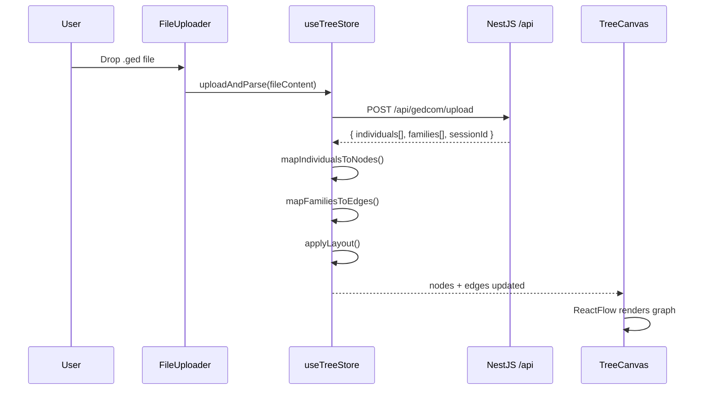

# noxwork-gedcom-web — Project Context

> **Last updated:** 2026-02-21
> **Status:** Phase 1 — Canvas setup & custom node component ✅
> **Runtime:** React 19 + Vite 7 + TypeScript 5.9 (strict mode)
> **Target:** ES2022, bundler module resolution

---

## 1. Project Overview

`noxwork-gedcom-web` is the **frontend** of the Noxwork GEDCOM Labs platform. It is part of a **monorepo** located at `noxwork-gedcom/` alongside the backend (`noxwork-gedcom-api`).

The frontend is responsible for:
- Uploading GEDCOM files and sending them to the backend API
- Visualizing parsed family trees as an interactive graph using React Flow
- Displaying enriched individual data including multi-role kinship overlaps
- (Future) Applying automatic hierarchical layout via Dagre/ELK
- (Future) Exporting tree visualizations as PDF/PNG

The **backend** (NestJS 11 at `localhost:3000`) parses GEDCOM files and resolves kinship relationships.

---

## 2. Tech Stack

| Layer          | Technology                     | Notes                                           |
|----------------|--------------------------------|-------------------------------------------------|
| Framework      | React 19                       | Functional components, hooks only               |
| Build Tool     | Vite 7                         | `@vitejs/plugin-react`                          |
| Language       | TypeScript 5.9                 | Strict mode, `verbatimModuleSyntax`             |
| Visualization  | React Flow v12 (`@xyflow/react`) | Custom nodes, dark `colorMode`                |
| State          | Zustand 5                      | Single store, no boilerplate                    |
| Styling        | Tailwind CSS v4                | CSS-first config via `@tailwindcss/vite`        |
| Linting        | ESLint 9 + react-hooks plugin  |                                                 |

---

## 3. Folder Structure

```
noxwork-gedcom-web/
├── src/
│   ├── main.tsx                                    # React root (StrictMode)
│   ├── App.tsx                                     # Dashboard layout: sidebar + canvas
│   ├── index.css                                   # Tailwind + Noxwork design tokens
│   │
│   ├── types/                                      # ══ Shared TypeScript Types ══
│   │   └── api.ts                                  # Backend API response types + PersonNodeData
│   │
│   ├── store/                                      # ══ State Management ══
│   │   └── useTreeStore.ts                         # Zustand store (upload, parse, layout)
│   │
│   └── features/                                   # ══ Feature Modules ══
│       ├── visualizer/                             # Tree visualization
│       │   ├── TreeCanvas.tsx                      # React Flow canvas (background, controls, minimap)
│       │   └── nodes/
│       │       └── PersonNode.tsx                  # Custom node (gender border, multi-role badge)
│       │
│       └── uploader/                               # File import
│           └── FileUploader.tsx                    # Drag-and-drop .ged upload
│
├── public/                                         # Static assets
├── index.html                                      # Entry HTML
├── vite.config.ts                                  # Vite + Tailwind v4 + API proxy
├── tsconfig.json                                   # Project references root
├── tsconfig.app.json                               # App-level strict TS config
├── tsconfig.node.json                              # Node-level (vite.config)
├── eslint.config.js
└── package.json
```

---

## 4. Architecture & Design Patterns

### 4.1 Component Structure (Feature-Based)

Components are organized by **feature area**, not by type:

```
features/
  visualizer/  → TreeCanvas + PersonNode (graph rendering)
  uploader/    → FileUploader (file import)
```

### 4.2 State Management (Zustand)

Single store `useTreeStore` manages the entire tree lifecycle:

```
uploadAndParse(fileContent) → fetch /api/gedcom/upload → map to nodes/edges → set state
```

- **Nodes:** Each `GedcomIndividual` → React Flow `Node<PersonNodeData>` of type `'person'`
- **Edges:** Built from `GedcomFamily` records:
  - `husbandId ↔ wifeId` = Spouse edge (dashed, orange `#FF8C00`)
  - `parentId → childId` = Parent-child edge (solid, cobalt `#0047AB`)
- **Layout:** `applyLayout()` is a placeholder using grid positioning, to be replaced with Dagre

### 4.3 Custom Node System (React Flow)

React Flow's `nodeTypes` registry maps `'person'` → `PersonNode` component:
- **Gender border:** Left-accent colored by sex (blue M, orange F, gray U)
- **Multi-role badge:** Amber `⚠ N` badge when `detectedRoles.length > 1`
- **Role tags:** Up to 3 role type pills shown, "+N more" for overflow
- **Handles:** Top (target, cobalt) and bottom (source, orange)

### 4.4 API Proxy

Vite dev server proxies `/api/*` to `http://localhost:3000` to avoid CORS issues during development. In production, configure the reverse proxy at the deployment layer.

### 4.5 Tailwind v4 (CSS-First Configuration)

No `tailwind.config.js` file. Design tokens are defined in `index.css` using `@theme`:

```css
@theme {
  --color-nox-cobalt: #0047AB;
  --color-nox-orange: #FF8C00;
  --color-nox-surface: #0f172a;
  /* ... */
}
```

These generate Tailwind utility classes like `bg-nox-cobalt`, `text-nox-orange`, `border-nox-surface-lighter`.

---

## 5. Design Tokens (Noxwork Palette)

| Token                | Value       | Usage                          |
|----------------------|-------------|--------------------------------|
| `nox-cobalt`         | `#0047AB`   | Primary brand, parent edges    |
| `nox-cobalt-light`   | `#1a6dd4`   | Hover states, active accents   |
| `nox-cobalt-dark`    | `#003080`   | Deep accents                   |
| `nox-orange`         | `#FF8C00`   | Secondary brand, spouse edges  |
| `nox-orange-light`   | `#ffaa40`   | Hover states                   |
| `nox-surface`        | `#0f172a`   | Main background (slate-900)    |
| `nox-surface-light`  | `#1e293b`   | Card/node backgrounds          |
| `nox-surface-lighter`| `#334155`   | Borders, separators            |
| `nox-text`           | `#f1f5f9`   | Primary text                   |
| `nox-text-muted`     | `#94a3b8`   | Secondary/label text           |
| `nox-male`           | `#3b82f6`   | Male gender indicator          |
| `nox-female`         | `#f97316`   | Female gender indicator        |
| `nox-unknown`        | `#6b7280`   | Unknown gender indicator       |
| `nox-warning`        | `#f59e0b`   | Multi-role badge               |
| `nox-danger`         | `#ef4444`   | Errors, destructive actions    |

---

## 6. Data Flow

### Upload → Visualization Pipeline



### PersonNodeData Shape

| Field           | Type                  | Source                            |
|-----------------|-----------------------|-----------------------------------|
| `fullName`      | `string`              | `individual.fullName`             |
| `givenName`     | `string`              | `individual.givenName`            |
| `surname`       | `string`              | `individual.surname`              |
| `sex`           | `'M' \| 'F' \| 'U'`  | `individual.sex`                  |
| `birthDate`     | `string \| null`      | `individual.birthDate`            |
| `deathDate`     | `string \| null`      | `individual.deathDate`            |
| `birthPlace`    | `string \| null`      | `individual.birthPlace`           |
| `detectedRoles` | `ApiDetectedRole[]`   | `individual.detectedRoles ?? []`  |
| `gedcomId`      | `string`              | `individual.id` (e.g. `@I1@`)    |

---

## 7. Available npm Scripts

| Script    | Command                  | Purpose                         |
|-----------|--------------------------|---------------------------------|
| `dev`     | `vite`                   | Dev server with HMR at `:5173`  |
| `build`   | `tsc -b && vite build`   | Type-check + production build   |
| `preview` | `vite preview`           | Preview production build        |
| `lint`    | `eslint .`               | Lint all source files           |

---

## 8. TypeScript Configuration

Uses Vite's **project references** pattern:
- `tsconfig.json` → root, references `app` and `node` configs
- `tsconfig.app.json` → strict, `ES2022`, `react-jsx`, `bundler` resolution, `verbatimModuleSyntax`
- `tsconfig.node.json` → for `vite.config.ts` only

Key flags: `strict: true`, `noUnusedLocals`, `noUnusedParameters`, `erasableSyntaxOnly`

---

## 9. Roadmap

### ✅ Phase 1 — Canvas Setup & Custom Node
- [x] Vite + React 19 + TypeScript scaffolded
- [x] Tailwind v4 with Noxwork dark theme
- [x] React Flow canvas with background, controls, minimap
- [x] PersonNode with gender borders + multi-role badge
- [x] FileUploader with drag-and-drop
- [x] Zustand store with upload → parse → render pipeline

### 🔲 Phase 2 — Automatic Layout
- [ ] Integrate Dagre or ELK.js for hierarchical positioning
- [ ] Generational rank assignment
- [ ] Anti-overlap for consanguinity edges

### 🔲 Phase 3 — Interactivity
- [ ] Click node → detail panel / modal
- [ ] Search / filter individuals
- [ ] Highlight kinship paths on hover
- [ ] Zoom to selected individual

### 🔲 Phase 4 — Polish
- [ ] Responsive sidebar (collapsible on mobile)
- [ ] Keyboard shortcuts
- [ ] Export tree as PNG/PDF
- [ ] Loading skeleton during parse

### 🔲 Phase 5 — Deployment
- [ ] Vercel deploy configuration
- [ ] Environment variable management
- [ ] Production API URL configuration

---

## 10. Key Gotchas & Conventions

1. **Tailwind v4 uses CSS-first config** — design tokens go in `index.css` via `@theme`, NOT in a `tailwind.config.js`
2. **`verbatimModuleSyntax` is enabled** — use `import type { ... }` for type-only imports
3. **React Flow v12 import** — use `@xyflow/react`, NOT the old `reactflow` package
4. **React Flow `colorMode="dark"`** — enables built-in dark theme for controls/background
5. **Vite proxy** handles `/api` routing in dev — no hardcoded `localhost:3000` URLs in components
6. **Zustand v5** — no more `create<T>()(...)` double-call pattern; just `create<T>(...)` directly
7. **`proOptions={{ hideAttribution: true }}`** — removes React Flow watermark
8. **Node type key `'person'`** — registered in `TreeCanvas.tsx`, used in `useTreeStore.ts` when mapping
