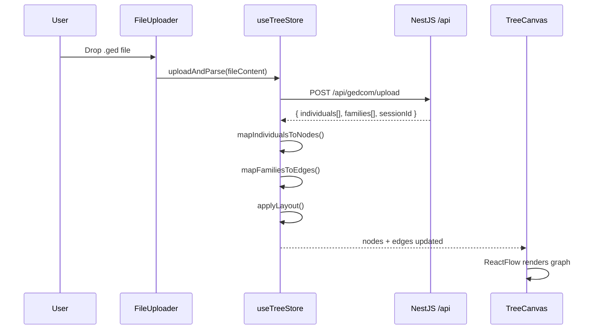

# noxwork-gedcom-web — Project Context

> **Last updated:** 2026-02-27
> **Status:** Phase 5 — Email Auth Flow ✅
> **Runtime:** React 19 + Vite 7 + TypeScript 5.9 (strict mode)
> **Target:** ES2022, bundler module resolution

---

## 1. Project Overview

`noxwork-gedcom-web` is the **frontend** of the Noxwork GEDCOM Labs platform. It is part of a **monorepo** located at `noxwork-gedcom/` alongside the backend (`noxwork-gedcom-api`).

The frontend is responsible for:
- **Auth:** Google SSO + Email/Password via Supabase Auth; JWT passed as `Authorization: Bearer` to backend; full password-recovery flow (forgot password, update password, resend confirmation)
- **Dashboard:** Overleaf-style project management — create, rename, delete, and open family tree projects
- Uploading GEDCOM files and sending them to the backend API
- Visualizing parsed family trees as an interactive graph using React Flow
- Displaying enriched individual data including multi-role kinship overlaps
- Automatic hierarchical layout via Dagre with spouse alignment
- **Editor Mode:** Adding, deleting, and moving nodes with real-time debounced sync to the backend
- (Future) Exporting tree visualizations as PDF/PNG

The **backend** (NestJS 11 at `localhost:3000`) parses GEDCOM files, resolves kinship relationships, and persists data via Prisma/PostgreSQL.

---

## 2. Tech Stack

| Layer          | Technology                     | Notes                                           |
|----------------|--------------------------------|-------------------------------------------------|
| Framework      | React 19                       | Functional components, hooks only               |
| Build Tool     | Vite 7                         | `@vitejs/plugin-react`                          |
| Language       | TypeScript 5.9                 | Strict mode, `verbatimModuleSyntax`             |
| Routing        | react-router-dom v7            | Declarative routes, `BrowserRouter`             |
| Auth           | @supabase/supabase-js v2       | Google OAuth, session management, JWT           |
| Visualization  | React Flow v12 (`@xyflow/react`) | Custom nodes, dark `colorMode`                |
| State          | Zustand 5                      | useAuthStore, useProjectStore, useTreeStore     |
| Layout         | Dagre (`@dagrejs/dagre`)       | Hierarchical TB positioning + spouse alignment  |
| Styling        | Tailwind CSS v4                | CSS-first config via `@tailwindcss/vite`        |
| Dates          | date-fns v4                    | `formatDistanceToNow` in ProjectTable           |
| Sync           | lodash.debounce                | Debounced API calls for node positioning        |
| Linting        | ESLint 9 + react-hooks plugin  |                                                 |

---

## 3. Folder Structure

```
noxwork-gedcom-web/
├── src/
│   ├── main.tsx                                    # React root (StrictMode + BrowserRouter)
│   ├── App.tsx                                     # Router component + auth initialization
│   ├── index.css                                   # Tailwind + Noxwork design tokens
│   │
│   ├── lib/                                        # ══ External Service Clients ══
│   │   └── supabase.ts                             # Supabase singleton + getAccessToken()
│   │
│   ├── types/                                      # ══ Shared TypeScript Types ══
│   │   └── api.ts                                  # Backend API response types + ProjectSummary + PersonNodeData
│   │
│   ├── store/                                      # ══ State Management ══
│   │   ├── useAuthStore.ts                         # Auth state: Google SSO, email sign-in/up, reset, resend, updatePassword
│   │   ├── useProjectStore.ts                      # Projects CRUD with optimistic updates
│   │   └── useTreeStore.ts                         # Zustand store (upload, parse, layout, editor)
│   │
│   ├── components/                                 # ══ Shared Components ══
│   │   ├── ProtectedRoute.tsx                      # Auth guard: spinner → Outlet or Navigate /login
│   │   └── Toast.tsx                               # Toast notification system (context + provider + hook)
│   │
│   ├── pages/                                      # ══ Route Pages ══
│   │   ├── LoginPage.tsx                           # Email/Password + Google SSO login; Sign-up toggle; Resend confirmation
│   │   ├── AuthCallback.tsx                        # Supabase OAuth/email callback → /dashboard or /update-password
│   │   ├── ForgotPassword.tsx                      # Send password-reset email via Supabase
│   │   ├── UpdatePassword.tsx                      # Set new password after recovery; live strength meter + validation
│   │   ├── Dashboard.tsx                           # Project list + create modal + search; unconfirmed-user banner
│   │   └── VisualizerPage.tsx                      # Tree editor (extracted from App.tsx) + back button
│   │
│   └── features/                                   # ══ Feature Modules ══
│       ├── visualizer/                             # Tree visualization
│       │   ├── TreeCanvas.tsx                      # React Flow canvas (background, controls, minimap)
│       │   └── nodes/
│       │       └── PersonNode.tsx                  # Custom node (gender border, multi-role badge)
│       │
│       ├── uploader/                               # File import
│       │   └── FileUploader.tsx                    # Drag-and-drop .ged upload
│       │
│       └── dashboard/                              # Dashboard feature components
│           ├── ProjectTable.tsx                    # Project rows, inline rename, ActionMenu, RelativeTime
│           └── EmptyState.tsx                      # Zero-state CTA: Create or Upload GEDCOM
│
├── public/                                         # Static assets
├── .env.example                                    # VITE_SUPABASE_URL, VITE_SUPABASE_ANON_KEY
├── index.html                                      # Entry HTML
├── vite.config.ts                                  # Vite + Tailwind v4 + API proxy
├── tsconfig.json                                   # Project references root
├── tsconfig.app.json                               # App-level strict TS config
├── tsconfig.node.json                              # Node-level (vite.config)
├── eslint.config.js
└── package.json
```

---

## 4. Architecture & Design Patterns

### 4.1 Component Structure (Feature-Based)

Components are organized by **feature area**, not by type:

```
features/
  visualizer/  → TreeCanvas + PersonNode (graph rendering)
  uploader/    → FileUploader (file import)
```

### 4.2 State Management (Zustand)

Single store `useTreeStore` manages the entire tree lifecycle:

```
uploadAndParse(fileContent) → fetch /api/gedcom/upload → map to nodes/edges → set state
```

- **Nodes:** Each `GedcomIndividual` → React Flow `Node<PersonNodeData>` of type `'person'`
- **Edges:** Built from `GedcomFamily` records:
  - `husbandId ↔ wifeId` = Spouse edge (straight, dashed, orange `#FF8C00`)
  - `parentId → childId` = Parent-child edge (smoothstep, solid, cobalt `#0047AB`)
- **Layout:** `applyLayout()` uses Dagre for hierarchical TB positioning.
- **Sync Logic:** Optimistic UI updates for adding/removing nodes and edges. Node position changes are debounced (2s) and synced via `PATCH /api/gedcom/node/:id`. Failed API calls trigger state rollbacks and error toasts.
  Spouse edges are excluded from the Dagre graph to preserve generational tiers;
  a post-processing step aligns each spouse node to the right of their partner at the same Y level.

### 4.3 Custom Node System (React Flow)

React Flow's `nodeTypes` registry maps `'person'` → `PersonNode` component:
- **Gender border:** Left-accent colored by sex (blue M, orange F, gray U)
- **Multi-role badge:** Amber `⚠ N` badge when `detectedRoles.length > 1`
- **Role tags:** Up to 3 role type pills shown, "+N more" for overflow
- **Handles:** Top (target, cobalt) and bottom (source, orange)

### 4.4 API Proxy

Vite dev server proxies `/api/*` to `http://localhost:3000` to avoid CORS issues during development. In production, configure the reverse proxy at the deployment layer.

### 4.5 Tailwind v4 (CSS-First Configuration)

No `tailwind.config.js` file. Design tokens are defined in `index.css` using `@theme`:

```css
@theme {
  --color-nox-cobalt: #0047AB;
  --color-nox-orange: #FF8C00;
  --color-nox-surface: #0f172a;
  /* ... */
}
```

These generate Tailwind utility classes like `bg-nox-cobalt`, `text-nox-orange`, `border-nox-surface-lighter`.

---

## 4.6 Routing (react-router-dom)

All routes are declared in `App.tsx` using `<Routes>`:

| Path                 | Component          | Guard          | Description                                          |
|----------------------|--------------------|----------------|------------------------------------------------------|
| `/login`             | `LoginPage`        | —              | Email/Password + Google SSO; Sign-up + Resend        |
| `/auth/callback`     | `AuthCallback`     | —              | OAuth/email confirmation → /dashboard; recovery → /update-password |
| `/forgot-password`   | `ForgotPassword`   | —              | Request password reset email                         |
| `/update-password`   | `UpdatePassword`   | —              | Set new password (requires PASSWORD_RECOVERY session) |
| `/dashboard`         | `Dashboard`        | ProtectedRoute | Project list; unconfirmed-user warning banner        |
| `/visualizer`        | `VisualizerPage`   | ProtectedRoute | Tree editor (no active project)                      |
| `/visualizer/:id`    | `VisualizerPage`   | ProtectedRoute | Tree editor for a specific project                   |
| `*`                  | —                  | —              | Redirects to `/dashboard`                            |

### Auth Flow

**Google SSO:**
```
Browser → /login → signInWithGoogle() → Supabase Google OAuth → /auth/callback
  AuthCallback: onAuthStateChange(SIGNED_IN) → setSession() → navigate('/dashboard')
```

**Email/Password sign-in:**
```
/login → signInWithEmail(email, password) → Supabase → session set via onAuthStateChange
```

**Email registration:**
```
/login (Register tab) → signUpWithEmail(email, password) → Supabase sends confirmation email
  → user clicks link → /auth/callback → navigate('/dashboard')
  → Dashboard shows "Awaiting Confirmation" banner if email_confirmed_at === null
```

**Password recovery:**
```
/forgot-password → resetPasswordForEmail(email) → Supabase sends reset email
  → user clicks link → /update-password (hash fragment)
  → UpdatePassword: onAuthStateChange(PASSWORD_RECOVERY) → setSessionReady
  → updateUser({ password }) → navigate('/dashboard')
```

**Resend confirmation:**
```
/login or /dashboard banner → resendConfirmation(email) → supabase.auth.resend()
```

**Session initialization:**
```
  App.tsx useEffect: initialize() → onAuthStateChange subscription
  ProtectedRoute: isLoading? spinner : user? <Outlet> : <Navigate to="/login">
```

### Session Token → API Calls

```
useProjectStore.authHeaders()
  → getAccessToken()  (src/lib/supabase.ts)
  → supabase.auth.getSession()
  → session.access_token
  → { Authorization: 'Bearer <jwt>' }
  → fetch('/api/projects', { headers })
```

---

## 5. Environment Variables

| Variable               | Required | Description                                |
|------------------------|----------|--------------------------------------------|
| `VITE_SUPABASE_URL`    | ✅ Yes   | Supabase project URL                       |
| `VITE_SUPABASE_ANON_KEY` | ✅ Yes | Supabase anonymous/public key              |

Both must be set in `.env.local` for development. See `.env.example` for reference.
Register `{origin}/auth/callback` in:
1. Supabase Dashboard → Authentication → URL Configuration → Redirect URLs
2. Google Cloud Console → OAuth 2.0 → Authorized redirect URIs

---

## 6. Design Tokens (Noxwork Palette)

| Token                | Value       | Usage                          |
|----------------------|-------------|--------------------------------|
| `nox-cobalt`         | `#0047AB`   | Primary brand, parent edges    |
| `nox-cobalt-light`   | `#1a6dd4`   | Hover states, active accents   |
| `nox-cobalt-dark`    | `#003080`   | Deep accents                   |
| `nox-orange`         | `#FF8C00`   | Secondary brand, spouse edges  |
| `nox-orange-light`   | `#ffaa40`   | Hover states                   |
| `nox-surface`        | `#0f172a`   | Main background (slate-900)    |
| `nox-surface-light`  | `#1e293b`   | Card/node backgrounds          |
| `nox-surface-lighter`| `#334155`   | Borders, separators            |
| `nox-text`           | `#f1f5f9`   | Primary text                   |
| `nox-text-muted`     | `#94a3b8`   | Secondary/label text           |
| `nox-male`           | `#3b82f6`   | Male gender indicator          |
| `nox-female`         | `#f97316`   | Female gender indicator        |
| `nox-unknown`        | `#6b7280`   | Unknown gender indicator       |
| `nox-warning`        | `#f59e0b`   | Multi-role badge               |
| `nox-danger`         | `#ef4444`   | Errors, destructive actions    |

---

## 7. Data Flow

### Upload → Visualization Pipeline



### PersonNodeData Shape

| Field           | Type                  | Source                            |
|-----------------|-----------------------|-----------------------------------|
| `fullName`      | `string`              | `individual.fullName`             |
| `givenName`     | `string`              | `individual.givenName`            |
| `surname`       | `string`              | `individual.surname`              |
| `sex`           | `'M' \| 'F' \| 'U'`  | `individual.sex`                  |
| `birthDate`     | `string \| null`      | `individual.birthDate`            |
| `deathDate`     | `string \| null`      | `individual.deathDate`            |
| `birthPlace`    | `string \| null`      | `individual.birthPlace`           |
| `detectedRoles` | `ApiDetectedRole[]`   | `individual.detectedRoles ?? []`  |
| `gedcomId`      | `string`              | `individual.id` (e.g. `@I1@`)    |

---

## 8. Available npm Scripts

| Script    | Command                  | Purpose                         |
|-----------|--------------------------|---------------------------------|
| `dev`     | `vite`                   | Dev server with HMR at `:5173`  |
| `build`   | `tsc -b && vite build`   | Type-check + production build   |
| `preview` | `vite preview`           | Preview production build        |
| `lint`    | `eslint .`               | Lint all source files           |

---

## 9. TypeScript Configuration

Uses Vite's **project references** pattern:
- `tsconfig.json` → root, references `app` and `node` configs
- `tsconfig.app.json` → strict, `ES2022`, `react-jsx`, `bundler` resolution, `verbatimModuleSyntax`
- `tsconfig.node.json` → for `vite.config.ts` only

Key flags: `strict: true`, `noUnusedLocals`, `noUnusedParameters`, `erasableSyntaxOnly`

---

## 10. Roadmap

### ✅ Phase 1 — Canvas Setup & Custom Node
- [x] Vite + React 19 + TypeScript scaffolded
- [x] Tailwind v4 with Noxwork dark theme
- [x] React Flow canvas with background, controls, minimap
- [x] PersonNode with gender borders + multi-role badge
- [x] FileUploader with drag-and-drop
- [x] Zustand store with upload → parse → render pipeline

### ✅ Phase 2 — Automatic Layout
- [x] Dagre integration for hierarchical top-to-bottom positioning
- [x] Spouse alignment post-processing (same Y, adjacent X)
- [x] Generational rank assignment via parent-child edge graph
- [ ] Anti-overlap for consanguinity edges

### ✅ Phase 3 — Editor Mode & Backend Sync
- [x] Add / delete individual nodes (with API sync)
- [x] Debounced position sync via `PATCH /api/gedcom/node/:id`
- [x] Optimistic updates with rollback on API failure

### ✅ Phase 4 — Dashboard & Auth
- [x] Supabase Google SSO (`signInWithGoogle`, `onAuthStateChange`)
- [x] React Router DOM routes: `/login`, `/auth/callback`, `/dashboard`, `/visualizer/:id`
- [x] `ProtectedRoute` guard redirecting unauthenticated users to `/login`
- [x] `Dashboard` page: project list, search, create modal
- [x] `ProjectTable`: inline rename, action menu, relative timestamps
- [x] `EmptyState`: zero-state CTA for Create / Upload GEDCOM
- [x] `useProjectStore`: CRUD operations with optimistic updates, JWT auth headers
- [x] `VisualizerPage` extracted from App.tsx with back-to-dashboard nav

### ✅ Phase 5 — Email Auth Flow
- [x] Email/Password sign-in and sign-up via `supabase.auth.signInWithPassword` / `signUp`
- [x] `ForgotPassword` page: sends reset email via `resetPasswordForEmail`
- [x] `UpdatePassword` page: PASSWORD_RECOVERY session detection, live strength meter, show/hide toggle, requirements checklist
- [x] Password validation: min 8 chars, uppercase, lowercase, number, special character
- [x] `AuthCallback` updated: handles `PASSWORD_RECOVERY` → `/update-password`, `SIGNED_IN` → `/dashboard`
- [x] `LoginPage` refactored: Sign In / Register tabs, Google SSO, Forgot Password link
- [x] "Resend confirmation email" button in LoginPage and Dashboard banner
- [x] Dashboard "Awaiting Confirmation" banner for users with `email_confirmed_at === null`
- [x] `Toast` system: Noxwork-branded toast notifications with success/error/info/warning variants
- [x] `ToastProvider` wraps the app in `main.tsx`

### 🔲 Phase 6 — Interactivity
- [ ] Click node → detail panel / modal
- [ ] Search / filter individuals
- [ ] Highlight kinship paths on hover
- [ ] Zoom to selected individual

### 🔲 Phase 6 — Polish
- [ ] Responsive sidebar (collapsible on mobile)
- [ ] Keyboard shortcuts
- [ ] Export tree as PNG/PDF
- [ ] Loading skeleton during parse

### 🔲 Phase 7 — Deployment
- [ ] Vercel deploy configuration
- [ ] Environment variable management
- [ ] Production API URL configuration

---

## 11. Key Gotchas & Conventions

1. **Tailwind v4 uses CSS-first config** — design tokens go in `index.css` via `@theme`, NOT in a `tailwind.config.js`
2. **`verbatimModuleSyntax` is enabled** — use `import type { ... }` for type-only imports
3. **React Flow v12 import** — use `@xyflow/react`, NOT the old `reactflow` package
4. **React Flow `colorMode="dark"`** — enables built-in dark theme for controls/background
5. **Vite proxy** handles `/api` routing in dev — no hardcoded `localhost:3000` URLs in components
6. **Zustand v5** — no more `create<T>()(...)` double-call pattern; just `create<T>(...)` directly
7. **`proOptions={{ hideAttribution: true }}`** — removes React Flow watermark
8. **Node type key `'person'`** — registered in `TreeCanvas.tsx`, used in `useTreeStore.ts` when mapping
9. **Spouse edges use `data.isSpouse`** — this flag controls Dagre exclusion and post-process alignment
10. **PersonNodeData needs `[key: string]: unknown`** — React Flow v12 requires node data to satisfy `Record<string, unknown>`
11. **`useAuthStore.initialize()`** must be called once in `App.tsx` via `useEffect` to rehydrate the Supabase session on page load and subscribe to `onAuthStateChange`
12. **Supabase env vars** — `VITE_SUPABASE_URL` and `VITE_SUPABASE_ANON_KEY` are required; `src/lib/supabase.ts` throws at import time if either is missing
13. **Auth redirect URIs** — Register both `{origin}/auth/callback` AND `{origin}/update-password` in Supabase Dashboard → Authentication → URL Configuration → Redirect URLs
14. **API auth headers** — `useProjectStore` calls `getAccessToken()` from `src/lib/supabase.ts` and adds `Authorization: Bearer {token}` to every request; expired sessions silently return `null` and requests return 401
15. **`OnNodesChange` generic default** — Avoid using `OnNodesChange` (defaults to `OnNodesChange<Node>`) for node-type-specific stores; use the explicit `(changes: NodeChange<Node<PersonNodeData>>[]) => void` signature instead
16. **Toast system** — `useToast()` hook from `src/components/Toast.tsx`; `ToastProvider` must wrap the app (done in `main.tsx`); toasts auto-dismiss after 4 seconds; success toasts use `nox-orange`
17. **Password recovery flow** — The `UpdatePassword` page listens for `onAuthStateChange(PASSWORD_RECOVERY)` which fires when Supabase exchanges the recovery hash fragment; the form is locked until this event fires
18. **Unconfirmed users** — Check `user.email_confirmed_at === null` (not falsy, as Google SSO users auto-confirm); unconfirmed users are allowed to reach the dashboard but see a warning banner with a resend button
19. **`supabase.auth.resend()`** — Used for signup confirmation resend; pass `{ type: 'signup', email }` matching the Supabase SDK v2 API
